# SHAPED Native 1.0 User Guide

This manual covers the complete user-facing feature set of SHAPED Native 1.0.1:
installation, editor controls, every sidebar menu, model construction,
transforms, animation, Preview, file formats, assembler export, command-line
automation, diagnostics, and the recovered SNES-development paths.

SHAPED Native intentionally preserves many 1991-1992 editor conventions. Read
the sections on selection order, compaction, saving, animation frames, and Undo
before using it on important work.

Every screenshot in this manual was captured from the native Windows build.
The figures show the exact button colors, menus, prompts, selectors, and status
messages you will see in version 1.0.1.

## Contents

1. [Installation and startup](#installation-and-startup)
2. [Screen layout and editor concepts](#screen-layout-and-editor-concepts)
3. [Mouse, cursor, origin, grid, and zoom](#mouse-cursor-origin-grid-and-zoom)
4. [Quick-start modeling workflow](#quick-start-modeling-workflow)
5. [Sidebar reference](#sidebar-reference)
6. [Dot and polygon selection](#dot-and-polygon-selection)
7. [Move, Copy, Size, Rotate, and Mirror](#move-copy-size-rotate-and-mirror)
8. [Groups](#groups)
9. [Animation](#animation)
10. [Preview and 3D-system view](#preview-and-3d-system-view)
11. [Loading, saving, and formats](#loading-saving-and-formats)
12. [Assembler exporters](#assembler-exporters)
13. [SNES development options](#snes-development-options)
14. [Tests and diagnostics](#tests-and-diagnostics)
15. [Keyboard reference](#keyboard-reference)
16. [Command-line reference](#command-line-reference)
17. [Limits and recovered behavior](#limits-and-recovered-behavior)
18. [Troubleshooting](#troubleshooting)

## Installation and startup

### Download the release

Download `Shaped.exe` or the Win64 ZIP from the
[latest GitHub release](https://github.com/kandowontu/shaped-native/releases/latest).
The executable is self-contained. It does not need DOSBox, a DOS runtime, or a
companion application DLL.

Windows system components such as GDI, User, Shell, Kernel, and the Universal
CRT API sets are still used. Windows may show a SmartScreen warning because the
release is not code-signed.

### Start with an empty editor

Double-click `Shaped.exe`, or run:

```powershell
.\Shaped.exe
```

### Open a model at startup

Pass a model path without an option:

```powershell
.\Shaped.exe "C:\Models\ship.3dcg"
```

The GUI opens with that file loaded. Quote paths containing spaces.

### Build from source

The supported source build uses CMake, Ninja, and a MinGW-w64 toolchain:

```powershell
cmake -S . -B build -G Ninja -DCMAKE_BUILD_TYPE=Release
cmake --build build
ctest --test-dir build --output-on-failure
```

The executable is written to `build/dist/Shaped.exe`.

## Screen layout and editor concepts

The client area preserves the original 640x480 layout:

| Area | Projection or purpose | Horizontal axis | Vertical axis |
|---|---|---:|---:|
| Upper left | Z/Y view | Z | Y |
| Upper right | X/Y view | X | Y |
| Lower left | Z/X view | Z | inverted X |
| Lower right | Status and embedded 3D-system view | — | — |
| Right strip | 24 main buttons or the active submenu | — | — |

Each orthographic pane is 280x240 pixels. The right sidebar is 80 pixels wide
and contains 24 rows of 80x20 pixels.

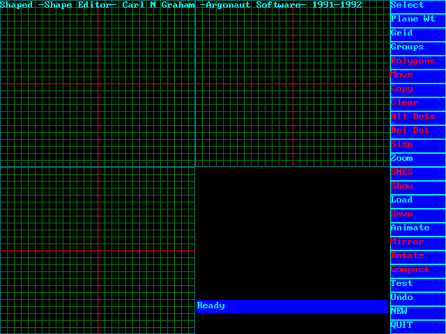

*The native editor at startup. Cyan commands are available; red commands need
model data or a selection before they can be used.*

### Colors and state

- Green grid lines show the current spacing. Red lines are the world-zero axes.
- Cyan sidebar text is enabled. Red sidebar text is disabled by the current
  model/selection state.
- A green submenu row is the currently selected radio or flag value.
- Dot and polygon editing colors indicate selection; they do not represent a
  polygon's stored export color.
- The blue field at lower right displays status and error messages.
- After the mouse settles over a view, the yellow coordinate strip displays
  the current three-dimensional cursor as X, Y, and Z.

### Dots, polygons, and frames

- A **dot** is a vertex position and may be selected independently.
- A **polygon** is an ordered list of 1 to 16 dot indices. One-vertex dot
  primitives and two-vertex line primitives are valid.
- Polygon winding is determined by the dot selection/order used to create it.
- A model can have up to 128 animation frames. Coordinates and active/selection
  flags are stored per frame.
- Eight polygon groups control editing assignment and visibility.

## Mouse, cursor, origin, grid, and zoom

### The three-dimensional cursor

Moving the mouse in a pane updates the two coordinates represented by that
pane. The third coordinate is retained from the cursor's complementary
projection. This lets you place a 3D point by establishing its coordinates
across more than one pane.

For example, move in X/Y to establish X and Y, then move in Z/Y to establish Z
while retaining the appropriate complementary coordinate. The coordinate strip
shows the resulting X/Y/Z position.

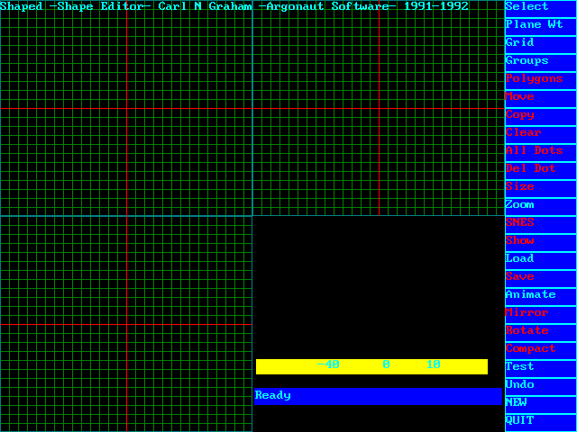

*After the pointer settles, the yellow strip reports the complete 3D cursor,
including the coordinate retained from the complementary projection.*

### Selecting and deselecting dots

In normal `Select` mode:

- Left-click near an unselected dot to select it.
- Right-click near a selected dot to deselect it.
- Selection uses the recovered three-dimensional nearest-versus-average test,
  so an ambiguous crowded click may intentionally select nothing.
- Selection order is recorded and later becomes polygon vertex order.

### Adding dots with the mouse

Click the first sidebar row to change `Select` to `Add Dot`. In Add Dot mode,
left-clicking one of the three orthographic panes inserts a dot at the full 3D
cursor position. Coordinates are snapped to the current grid. The new dot is
selected and appended to selection order.

Click `Add Dot` again to return to `Select` mode. The `.` keyboard shortcut
performs the same toggle.

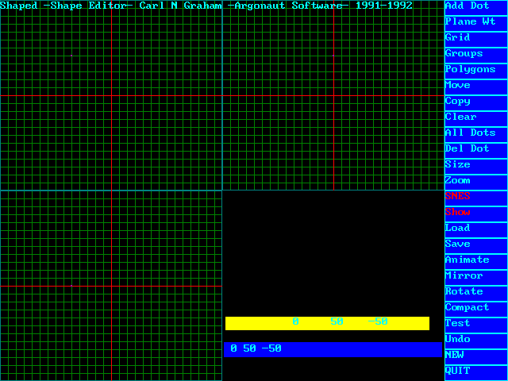

*The first sidebar row reads `Add Dot` while insertion mode is active. The blue
field reports the new point coordinates.*

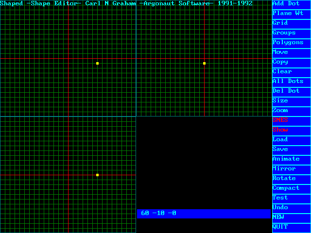

*A new dot is yellow because it is selected. Its three projected positions
refer to one 3D coordinate.*

### Moving the display origin

In the normal editor, the arrow keys pan the world origin by exactly five
screen pixels at the current zoom. The affected world axes depend on the pane
that most recently drove the 3D cursor. `Home` returns X, Y, and Z origin to
zero.

The origin changes the displayed view and the center used by interactive
Rotate. It does not rewrite model coordinates.

### Grid

`Grid` offers these spacings:

`1`, `2`, `5`, `10`, `15`, `20`, `30`, `50`, `100`, `150`, `200`, `300`,
`500`, `1000`, and `2000`.

The default is 10. Dot insertion and Move/Copy displacement use the active
grid. At distant zoom levels the display automatically skips grid lines that
would be closer than four screen pixels, without changing the logical grid.

Grid also affects `Compact`: its dot merge radius is `max(Grid / 8, 1)`.

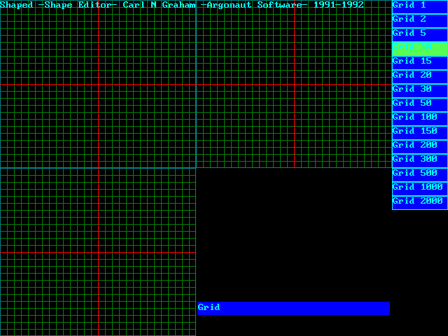

*The green row is the active spacing. Selecting Grid 100 produces the coarser
view below without changing model coordinates.*

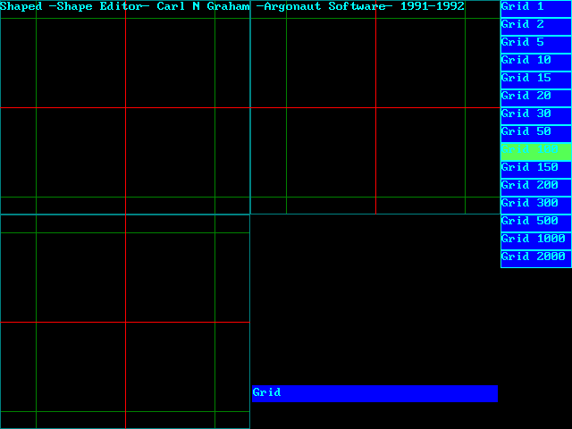

### Zoom

- `Zoom Up` halves the current projection scale.
- `Zoom Dwn` doubles the current projection scale.
- `Auto Zoom` fits all active dots into the views and recenters the origin on
  their integer bounding-box midpoint.

The menu names and direction are intentionally retained from DOS SHAPED.


*Auto Zoom is the fastest way to recover a model that has moved outside the
visible panes.*

## Quick-start modeling workflow

To create and save a triangle:

1. Start SHAPED with an empty model.
2. Leave the default grid at 10, or choose another value from `Grid`.
3. Click `Select` so it changes to `Add Dot`.
4. Establish the desired 3D cursor coordinates in the orthographic panes, then
   click to add the first dot.
5. Repeat for two more dots. Each added dot remains selected, preserving the
   insertion order.
6. Click `Add Dot` to return to selection mode.
7. Choose `Polygons > Create`. A three-vertex polygon is created using the
   dot-selection order.
8. Use `Show > Preview` to inspect its winding and orientation. Press `H` if
   you need to toggle hidden-surface removal.
9. Choose `Compact` before saving a compact-only format.
10. Choose `Save > 3DCG` for a full-fidelity editable file, or an assembler
    option for renderer output.

If winding is backward, select the polygon and use `Polygons > Flip`.

## Sidebar reference

The following table covers every main sidebar row. Rows whose requirements are
not currently satisfied appear in red and cannot be activated.

| Row | Button | Purpose |
|---:|---|---|
| 1 | Select / Add Dot | Toggle mouse selection and grid-snapped dot insertion. |
| 2 | Plane Wt | Set the legacy plane-classification tolerance. |
| 3 | Grid | Select logical grid and snapping spacing. |
| 4 | Groups | Regroup selected polygons, choose visible groups, or set the current group. |
| 5 | Polygons | Open polygon creation, selection, metadata, ordering, and deletion commands. |
| 6 | Move | Drag selected dots in one orthographic plane. |
| 7 | Copy | Duplicate the transform selection and drag the copy. |
| 8 | Clear | Clear dot and polygon selection. |
| 9 | All Dots | Select every active dot. |
| 10 | Del Dot | Mark selected dots inactive and deactivate polygons that reference them. |
| 11 | Size | Open the numeric Size Shape dialog. |
| 12 | Zoom | Open Zoom Up, Zoom Dwn, and Auto Zoom. |
| 13 | SNES | Open recovered SNES development-data commands when enabled. |
| 14 | Show | Enter modal Preview or enable the embedded 3D-system view. |
| 15 | Load | Open the recovered full-screen file selector and load a model. |
| 16 | Save | Save native formats or assembler streams. |
| 17 | Animate | Manage frames, key animation, and frame navigation. |
| 18 | Mirror | Open the five-option Mirror Shape dialog. |
| 19 | Rotate | Perform the recovered center/angle rotation workflow. |
| 20 | Compact | Merge, remove, pack, and reorder model topology. |
| 21 | Test | Run BSP selection diagnostics or polygon-twist analysis. |
| 22 | Undo | Swap the current shape with the single undo snapshot. |
| 23 | NEW | Confirm deletion of the whole current model. |
| 24 | QUIT | Confirm exit from SHAPED. |

### Plane Wt submenu

Available values are `0.001`, `0.01`, `0.1`, `0.5`, `1`, `2`, `5`, `10`, and
`100`. Smaller values classify points close to a plane more strictly; larger
values allow a wider coplanar tolerance. The reconstructed BSP builder may
derive a shape-scaled tolerance internally during its own pass.

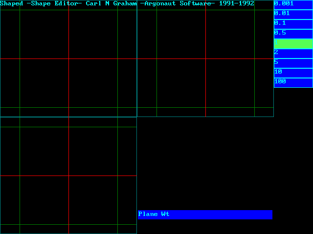

*Plane weight 1 is highlighted. This setting is primarily relevant to legacy
plane classification and BSP-oriented workflows.*

### Polygons submenu

| Command | Behavior |
|---|---|
| Create | Create a 1-16 vertex polygon from selected dots in selection order. The new polygon uses current color, type, and group. |
| Select | Select the active polygon with the greatest number of matching selected dots. |
| Deselect | Deselect the active polygon with the greatest number of matching selected dots. |
| Type | Open polygon type flags for new and selected real polygons. |
| Prev | Move polygon selection backward through displayed polygons. |
| Next | Move polygon selection forward through displayed polygons. |
| Select by | Open the count-aware Select Polygons dialog. |
| Flip | Reverse selected polygon winding. |
| Rot vert | Move the first vertex index of each selected polygon to the end without changing winding. |
| Delete | Mark selected polygons inactive. |
| Dft Col | Set the default color, from 0 through 255, used by new polygons. |
| colour | Set the color of selected polygons, from 0 through 255. |
| Sort | Apply the recovered line/type/normal-magnitude polygon ordering. |
| Draw last | Move selected polygons to the end in the recovered reverse-selected order. |
| Sel vert | Select every vertex used by selected line/polygon faces with two or more vertices. |

`Rot vert` does not create a new Undo snapshot, matching the recovered DOS
callback. Save before using it if you need a guaranteed rollback point.

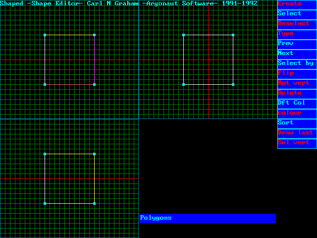

*The Polygons menu contains creation, selection, topology, type, color, order,
and vertex-selection commands. Red rows are unavailable in the shown state.*

### Polygon Type submenu

The `Poly` row is the inert base marker. The five toggleable attribute bits are:

| Row | Type bit | Meaning in recovered renderer data |
|---|---:|---|
| Light S | `0x02` | Lighting/intensity-related polygon form. |
| Vis Tst | `0x04` | Visibility-test-related polygon form. |
| Z Clip | `0x08` | Z-clipped command variant. |
| Plane | `0x10` | Plane/type ordering class. |
| BSP Node | `0x20` | BSP candidate weighting; receives a 25x splitter score. |

Opening `Type` initializes the menu from the first selected face with at least
two vertices in fixed slot order. Changing a flag updates the current default
and all eligible selected line/polygon faces. The initial default type is `7`.

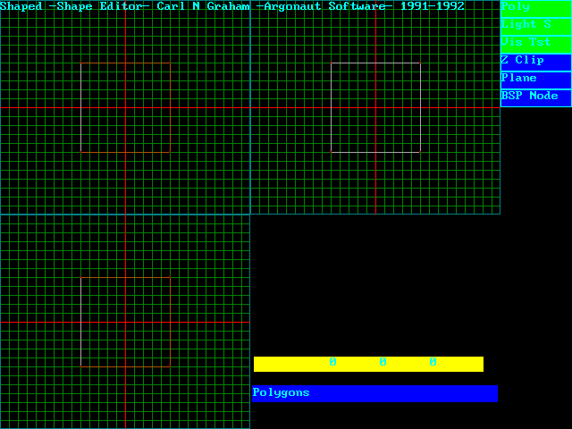

*Green rows are enabled type bits for the selected polygon and the default used
by subsequently created polygons.*

### Select Polygons dialog

`Polygons > Select by` presents current counts and these actions:

- Select all displayed polygons.
- Deselect all displayed polygons.
- Select polygons that use at least one currently selected dot.
- Deselect polygons that use at least one currently selected dot.
- Select 1-sided dot primitives.
- Select 2-sided line primitives.
- Select 3-, 4-, 5-, or 6-sided polygons.
- Select polygons with 7 or more sides.

Only polygons in the current display-group mask are changed. Click an action,
then `OK`; click `CANCEL` or press `Esc` to leave it unchanged.

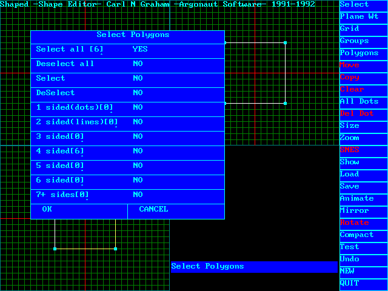

*Counts in brackets are live. Here the cube has six four-sided polygons.*

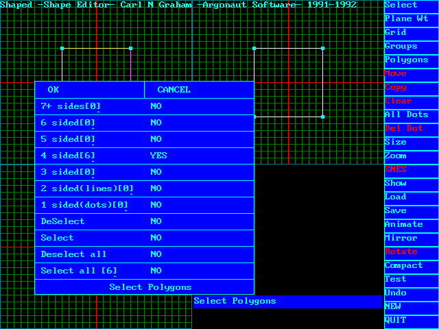

*Click an action row to switch it to `YES`, then choose `OK`.*

### Save submenu

| Command | Output |
|---|---|
| Internal | Quick-save `3DCG` data to the currently loaded path. |
| 3DCG | Choose a destination and save the full internal editor format. |
| 3DG1 | Choose a destination and save one-frame M3D data. |
| ASM GZS | Save the recovered GZS macro stream. |
| ASM BSP | Save the recovered BSP macro stream. |
| ASM PC | Save the recovered PC renderer command stream. |

See [Loading, saving, and formats](#loading-saving-and-formats) before using
`Internal`; it deliberately writes to the loaded input path.

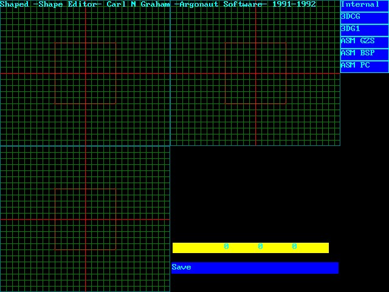

*The six Save choices cover the editable master formats and all three recovered
assembler exporters.*

### Animate submenu

| Command | Behavior |
|---|---|
| Frames | Open the six-action Animation Frames dialog. |
| Key Frame | Deform selected dots from a compatible control-point animation. |
| Shift An | Rotate selected dot/selected-polygon vertex records forward by one frame. |
| Next | Go to the next frame, wrapping at the end. |
| Prev | Go to the previous frame, wrapping at the start. |
| Add | Insert a duplicate of the current frame immediately after it. |

### Test submenu

- `BSP` opens `Nodes`, `Xing polys`, and `Need 2 cut` diagnostics.
- `Twist` analyzes non-triangular polygon planarity, reports average twist, and
  selects polygons above the recovered threshold.

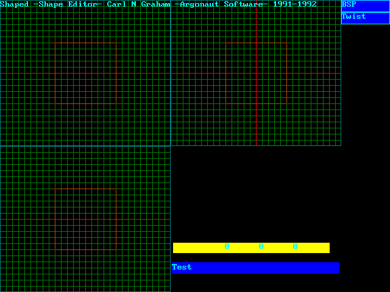

### NEW and QUIT confirmations

`NEW` (`X`) asks before deleting the entire current model. `QUIT` (`Q`) asks
before closing SHAPED. In either prompt, choose `CANCEL` or press `Esc` to
return without changing anything.

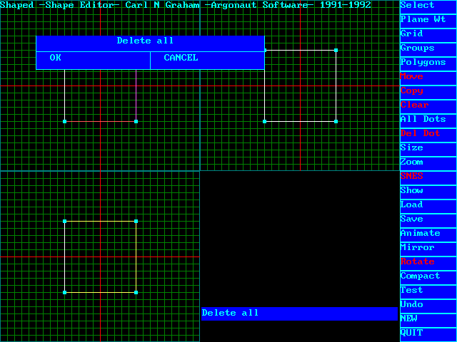

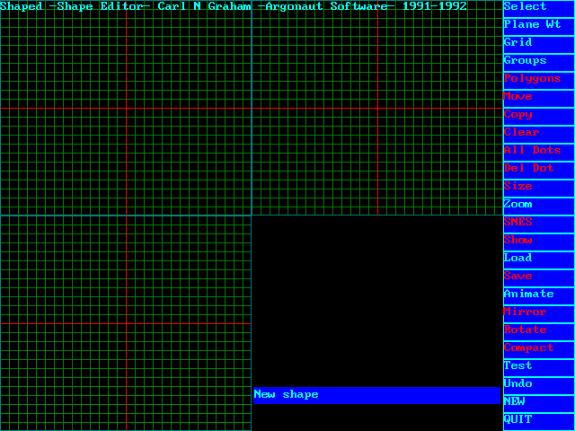

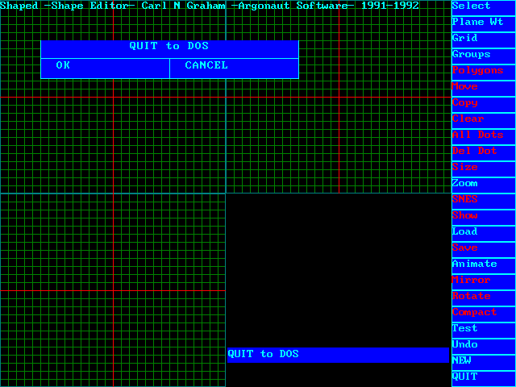

## Dot and polygon selection

### Ordered dot selection

Dot selection is an ordered list, not just a set. `Polygons > Create` uses that
list as its vertex order. Deselecting a dot removes it from the list;
reselecting it appends it to the end. This is the simplest way to change winding
or rotate a new polygon's starting vertex before creation.

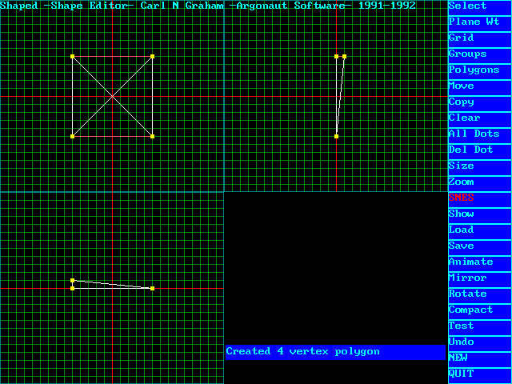

*The crossing projection makes the importance of ordered selection visible:
SHAPED connects vertices exactly in the order in which they were selected.*

### Polygon selection is separate

Selecting dots does not automatically select polygons. Use the `Polygons`
submenu to select/deselect polygons based on matching vertices, cycle one at a
time, select by topology, or select all polygon vertices.

`Clear` clears both dot and polygon selection. `All Dots` affects dots only.

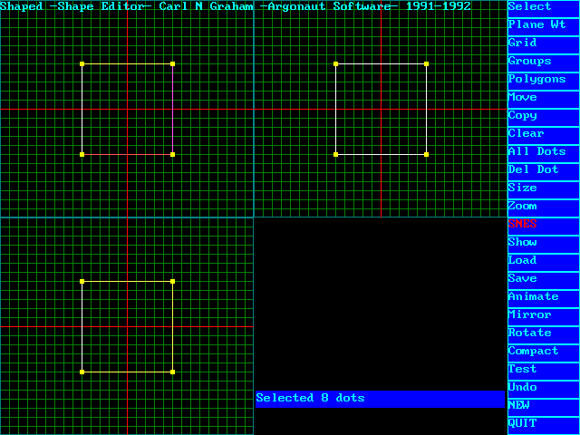

*`All Dots` (or `A`) selects every active dot; polygon selection remains a
separate state.*

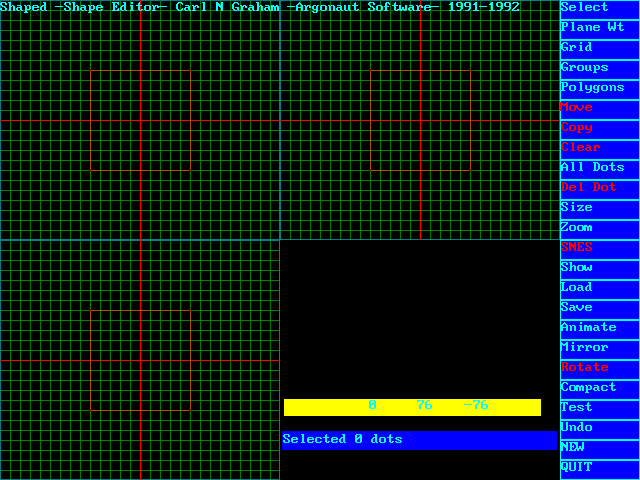

Polygon colors are edited through `Polygons > Dft Col` for the creation
default, or `Polygons > colour` for selected polygons. Values range from 0 to
255. The dialog uses the same click-to-edit behavior as the transform dialogs.

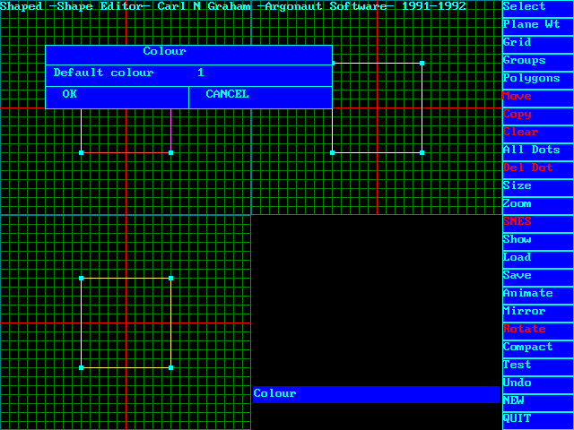

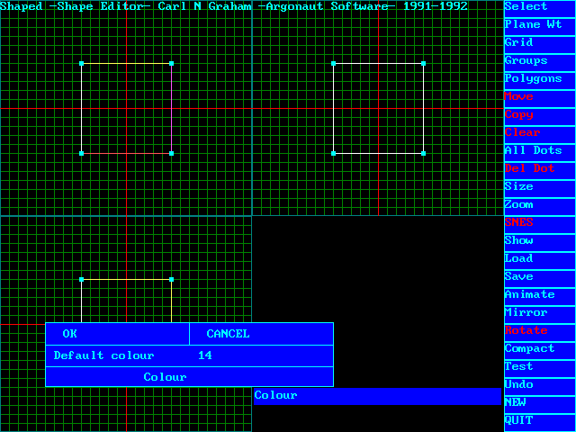

### Deleting dots and polygons

`Del Dot` deactivates selected dots in every frame. Any polygon referring to a
deleted dot is also deactivated. `Polygons > Delete` deactivates only selected
polygons. Neither operation immediately shrinks the fixed slot arrays; use
`Compact` when you are ready to pack the model.

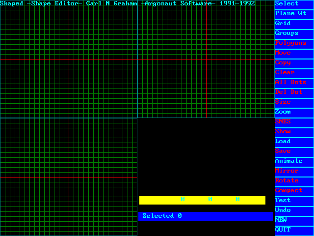

*Deleting every selected dot also deactivates all polygons that reference
those dots, leaving an empty view until Undo or a new load.*

### Compact

`Compact` performs several topology operations in one undoable command:

1. Spread current-frame active flags to the animation frames.
2. Merge active dots within `max(Grid / 8, 1)` world units.
3. Remove inactive and invalid polygon references.
4. Remove repeated vertices inside a polygon.
5. Remove cyclic duplicate polygons; reversed winding is considered distinct.
6. Pack inactive dot and polygon holes.
7. Reorder dots using the recovered fixed/animated and mirrored-pair ordering.
8. Rebuild polygon indices and selection order.

Because grid controls merge distance and compaction reorders indices, save a
copy first when exact slot identity matters.

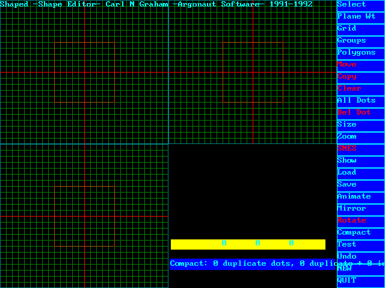

*The status summary reports merged dots and duplicate or invalid topology. A
long summary may extend underneath the fixed-width sidebar, as in DOS SHAPED.*

## Move, Copy, Size, Rotate, and Mirror

### Move

1. Select one or more dots.
2. Click `Move` or press `M`.
3. Press and drag in one orthographic pane.
4. Release to finish.

Movement is limited to that pane's two axes. Displacement is calculated as
snapped-current minus snapped-start, using the current grid. On an animated
shape, Move changes the current frame only.

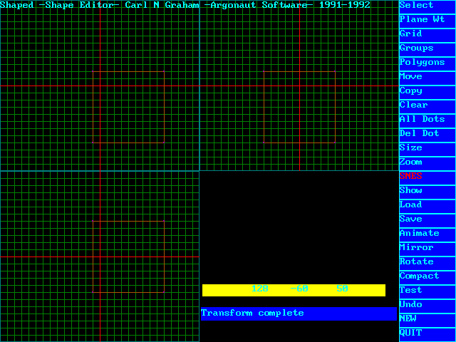

*A drag in one pane changes that pane's two world axes; the status field
confirms the transform when the mouse is released.*

### Copy

1. Select dots and/or polygons.
2. Click `Copy`.
3. Press and drag in an orthographic pane.
4. Release to finish.

Copy includes selected dots plus the vertices of selected polygons. It
duplicates eligible selected polygons, preserves animation coordinates across
all frames, assigns copied points to the current group, and then moves the copy
in the selected plane. Recovered inactive slot/extent behavior may leave holes
until the next Compact.

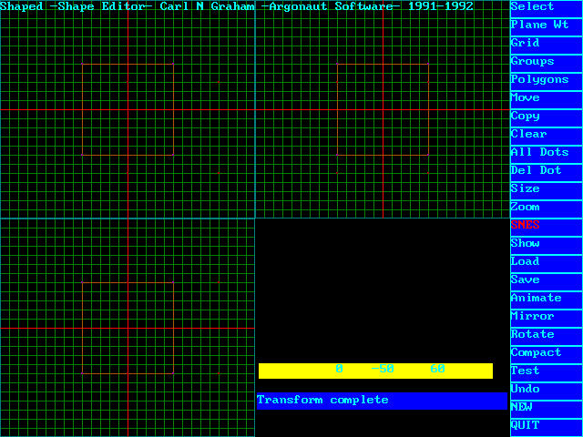

*Copy preserves the original and places the duplicated transform selection at
the snapped drag offset.*

### Size Shape dialog

`Size` or `Z` opens six rows:

| Row | Purpose |
|---|---|
| Scale All | Enter one nonzero value and commit the field to copy it to X, Y, and Z. |
| Scale X | X-coordinate multiplier. |
| Scale Y | Y-coordinate multiplier. |
| Scale Z | Z-coordinate multiplier. |
| Selected Dots Only | `YES` limits scaling to selected dot flags. |
| All frames | `YES` scales every frame; `NO` scales only the current frame. |

Defaults are `1.0`, `Selected Dots Only = NO`, and `All frames = YES`.
Scaling multiplies world coordinates around world zero; it does not scale
around the panned display origin.

Click a numeric value and type. The first typed character replaces the old
value. `Enter` commits an active field; press `Enter` again or click `OK` to
apply the dialog. `Esc` or `CANCEL` restores the pre-dialog shape.

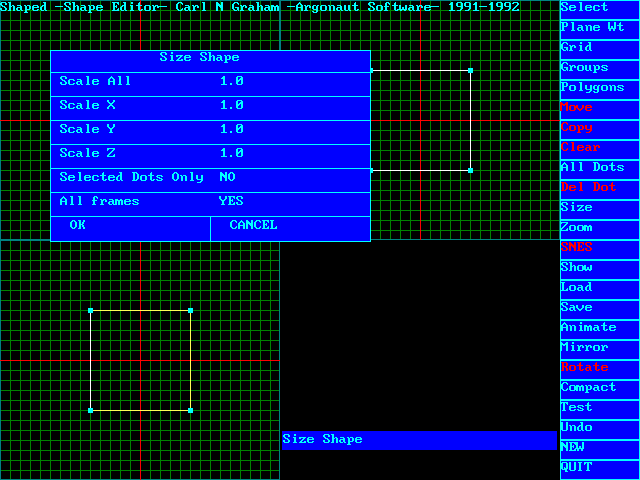

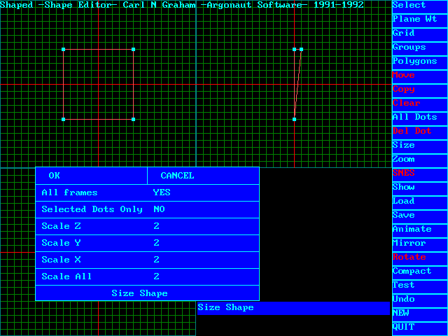

*Editing `Scale All` propagates the committed value to X, Y, and Z. Toggle
selection and frame scope before choosing `OK`.*

### Rotate

Rotate uses the recovered multi-stage interaction:

1. Select dots and/or polygons.
2. Click `Rotate`.
3. In the desired orthographic pane, click the rotation center and release.
4. Move away from the center, then press and drag in the same pane to define
   the starting ray and angle.
5. Release when the status field shows the desired angle.
6. At `Add image`, choose `NO` to retain the rotated original or `YES` to
   restore the original and add the rotated result as a duplicate.

Rotation includes selected dots plus vertices of selected polygons and changes
the current frame's transformed coordinates. `Esc` cancels an active stage and
restores the saved snapshot.

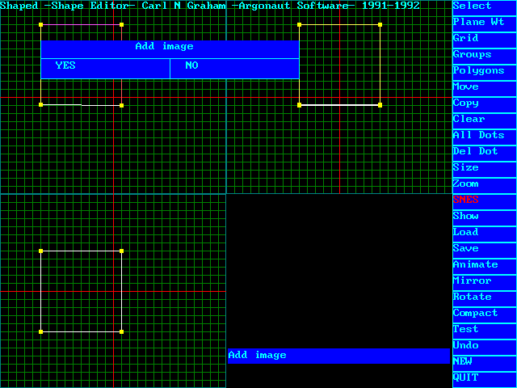

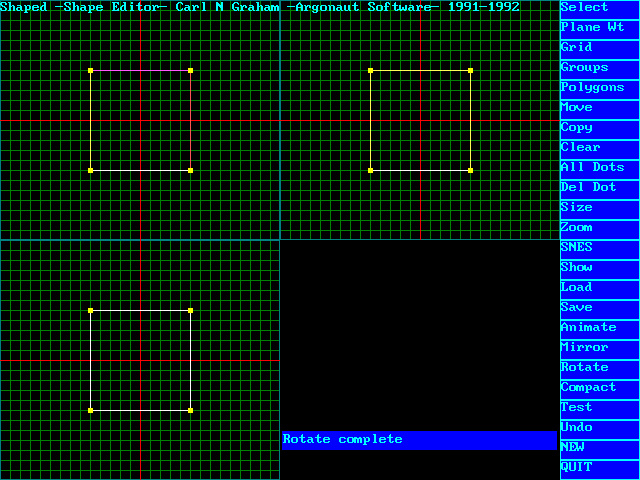

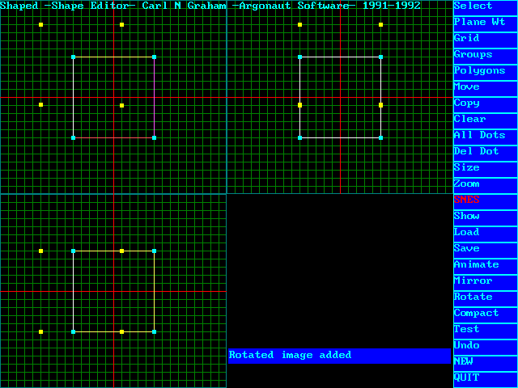

### Mirror Shape dialog

Mirror reflects around world zero and offers:

- `X reflect`
- `Y reflect`
- `Z reflect`
- `Selected only`
- `Add image`

Default state is X reflection and Add image enabled. If selected polygons exist,
Selected only initially becomes enabled. Turning Add image off forcibly turns
Selected only off, matching DOS behavior.

With Add image enabled, reflected dots and selected polygons are added while
the original remains. Without it, eligible points are changed in place. Mirror
updates all animation frames and performs one unconditional winding reversal
for affected polygons, including the recovered zero-axis/two-axis edge cases.

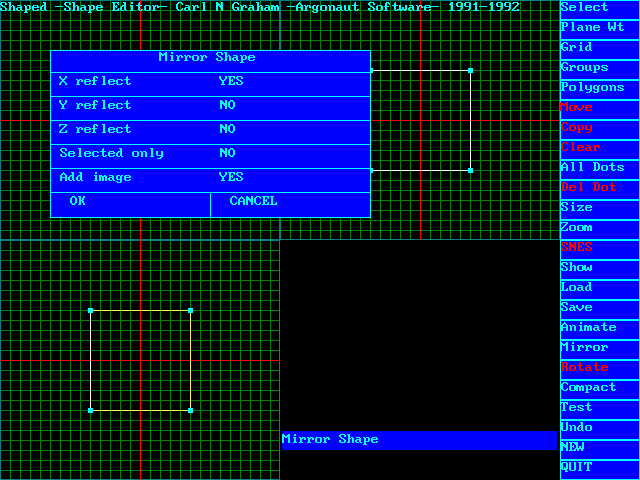


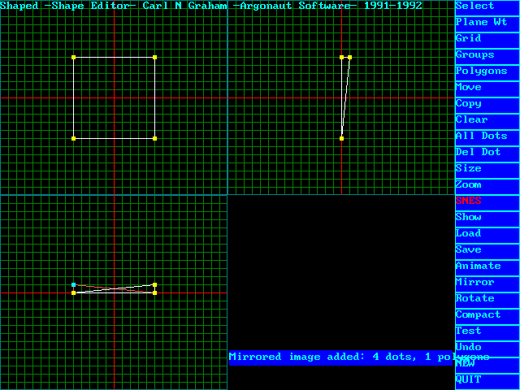

`Undo` swaps the current shape with the one saved snapshot. The same button can
therefore act like a one-level redo when clicked again.

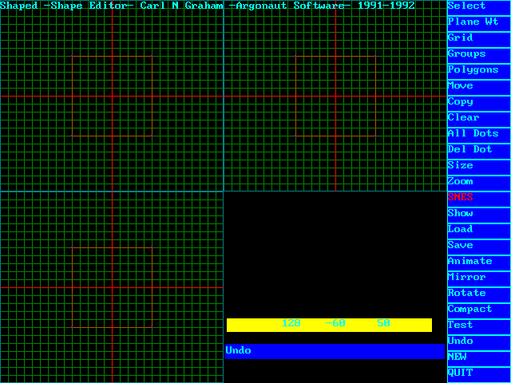

## Groups

SHAPED provides eight group bits.

- `Groups > Set > 1..8` sets the current group and displays only that group.
  New dots, polygons, and copied content use the current group.
- `Groups > Displayed > All` displays every group.
- `Groups > Displayed > 1..8` displays one group without changing assignment.
- `Groups > Regroup` assigns selected polygons to the current group.

`F1` through `F8` select the corresponding current group. Number keys `1`
through `8` change the displayed group. Several polygon-selection operations
only affect displayed groups.

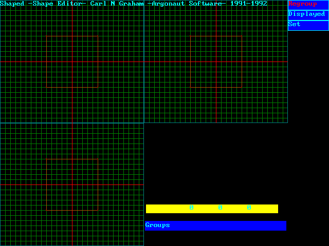

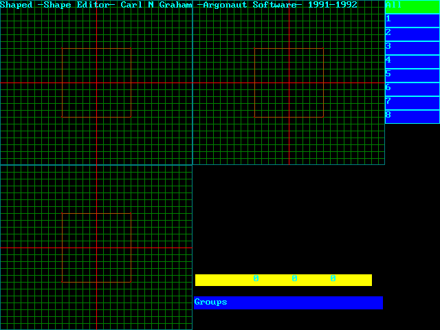

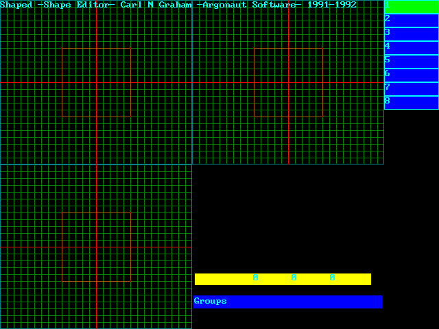

*`Displayed` changes the visibility mask. `Set` changes the destination group
for new or regrouped content and also isolates that group.*

## Animation

### Frame model

A shape can contain 1 to 128 frames. Frame navigation wraps at both ends.
Visiting a frame clears that frame's old dot selection flags and reapplies the
global ordered dot selection to the same dot indices.

### Animation Frames dialog

`Animate > Frames` provides:

| Action | Value/behavior |
|---|---|
| Next | Select and run to advance one frame. |
| Previous | Select and run to move back one frame. |
| Add (frames) | Insert the entered number of current-frame copies after the current frame. |
| Delete (frames) | Delete the entered number beginning at the current frame, while retaining at least one frame. |
| Copy to frame | Copy current frame data to the entered one-based destination. Frame 1 is not accepted as a destination. |
| Show all | Overlay dot records from every frame once in cyclic next-frame order, drawing the current frame last. |

The model is limited to 128 frames. Show-all ends when the next ordinary input
action is received.

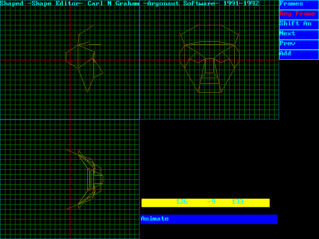

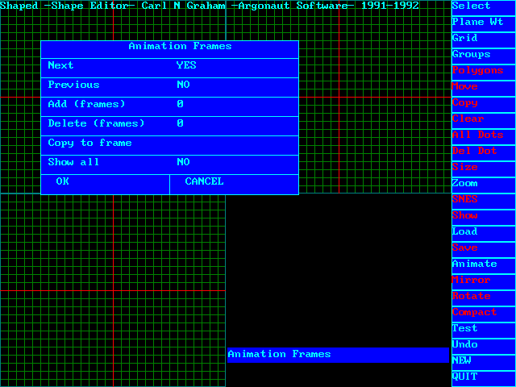

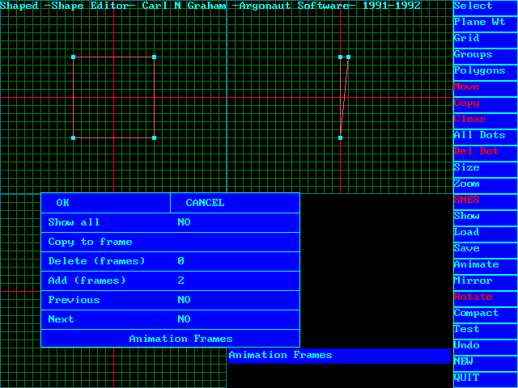


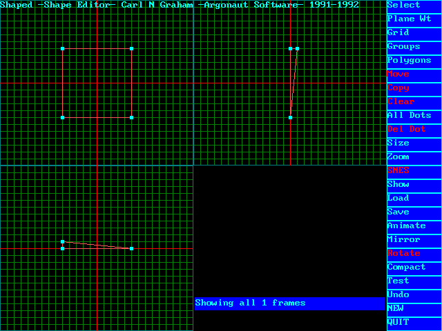

*The menu handles frequent one-frame actions; the dialog provides counted add,
delete, copy, navigation, and the temporary Show all overlay.*

### Add, Next, and Prev

- `Animate > Add` or `N` inserts one duplicate after the current frame and
  selects the new frame.
- `Animate > Next` or `]` advances with wraparound.
- `Animate > Prev` or `[` moves backward with wraparound.

### Shift An

`Shift An` identifies currently selected dots and vertices belonging to
selected polygons, spreads their active flags, and rotates each selected
record's coordinates forward through the frame sequence. The last frame moves
to frame 1. Unselected records remain in place.

### Key Frame

Key Frame loads a `3DCG` animation containing up to 16 control dots. It can
only be applied while the edited shape has one frame. Selected edited dots are
deformed across the key's frames using the recovered inverse-square weighting
from each edited dot to the key's frame-1 control points.

This is a deformation workflow, not a whole-model frame replacement. A selected
dot exactly coincident with a key point can create the same division edge case
as the original algorithm; keep key controls distinct when possible.

## Preview and 3D-system view

### Modal Preview

`Show > Preview` or `#` replaces the 560x480 editor workspace with the recovered
perspective Preview while retaining the sidebar. It starts at the current frame,
spreads current-frame flags to every frame, resets scale/distance from the
current editor zoom, and retains Preview angles and hidden-surface state between
entries.

| Key | Preview action |
|---|---|
| Left / Right | Rotate around the preview Y axis. |
| Up / Down | Rotate around the preview X axis. |
| `,` or `[` | Rotate positively around the preview Z axis. |
| `.` or `]` | Rotate negatively around the preview Z axis. |
| Page Up | Increase preview projection scale. |
| Page Down | Decrease preview projection scale. |
| `+` | Increase camera distance. |
| `-` | Decrease camera distance. |
| `H` | Toggle hidden-surface removal. It is initially enabled. |
| Home | Reset the three preview angles to zero. |
| `P` | Previous animation frame. |
| `N` | Next animation frame. |
| `X`, `Q`, Space, or Enter | Exit Preview. |

Home resets angles only; it does not reset Preview scale or distance.


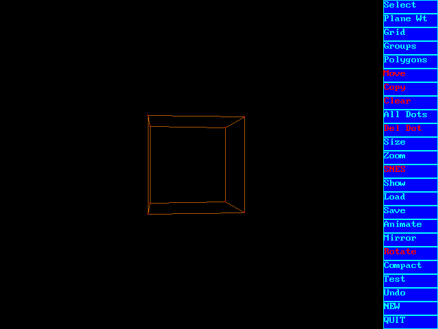

*Preview occupies the full editor workspace while leaving the right sidebar
visible. Use the listed keys; normal editor clicks are suspended until exit.*

### Embedded 3D-system view

`Show > 3D sys` activates a filled, perspective, BSP-ordered view in the
lower-right quadrant. This is the native replacement for the DOS callback that
generated a renderer stream and launched proprietary Argonaut hardware tools.

If a SNES BGR555 palette has been loaded, this view uses it. The main editor and
modal Preview retain the fixed EGA colors. Selected polygons receive a white
edge. Texture files can be selected through the recovered data menu, but the
native view does not emulate the unavailable target-hardware texture mapper.

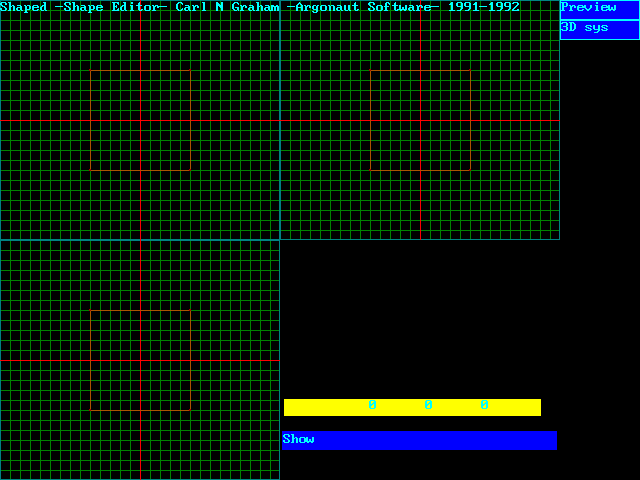

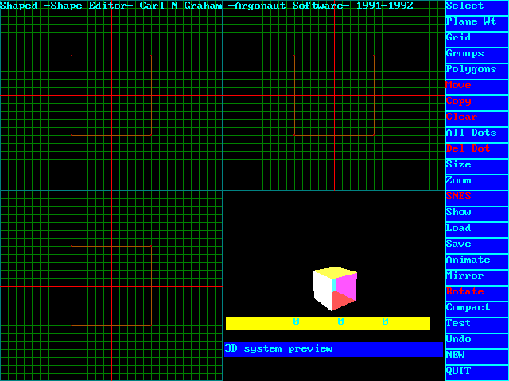

*Unlike modal Preview, 3D sys keeps the orthographic editor visible and fills
polygons using stored colors or the loaded SNES palette.*

## Loading, saving, and formats

### File selector

All interactive loads and saves use the recovered five-column selector.

- Directories appear in brackets. Click a directory to enter it.
- Click a file to put its name in the `Name` field, then click `OK`.
- Click `Path` or `Name` to edit it. The first typed character replaces the
  existing field; Backspace removes characters.
- `<<` and `>>` page through additional columns.
- `Esc` or `CANCEL` cancels.
- `Enter` first finishes an active field. With no field active, it accepts.

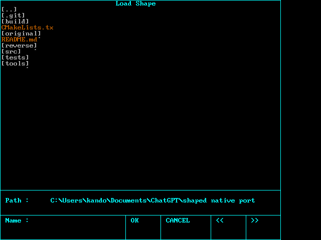

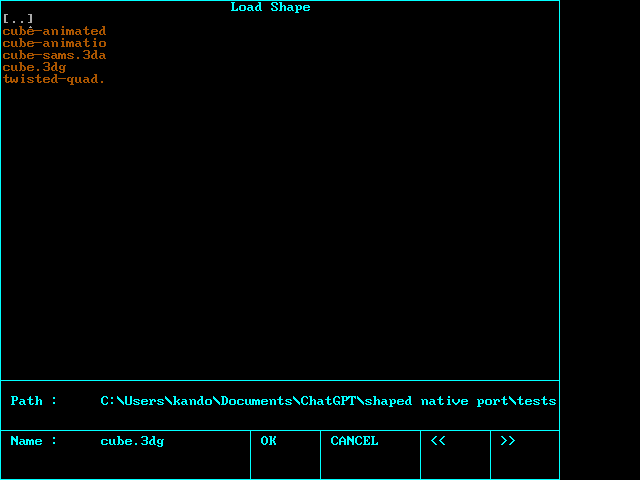


*Select a directory or file in the list, confirm the `Name` field, then choose
`OK`. The blue editor status reports the loaded dot and polygon counts.*

### Supported input formats

| Signature | Name | Frames | Main characteristics |
|---|---|---:|---|
| `3DG1` | M3D | 1 | Dots plus vertex lists and colors; current default type/group applied. |
| `3DCG` | Internal | 1-128 | Full frame flags, polygon color, flags, type, and selection metadata. |
| `3DAN` | Animation | 1-128 | Per-frame dots and packed polygon color/type. |
| `3DA1` | SAMS animation | 1-128 | Fixed plus animated dots, SAMS Y negation, winding reversal, and packed type table. |

Coordinates are stored with signed 16-bit DOS semantics: values are truncated
toward zero and wrapped to the low 16 bits.

See [reverse/FORMATS.md](../reverse/FORMATS.md) for the recovered text grammars.

### Choosing a save format

Use `3DCG` for editable master files. It is the only recovered format that
preserves every frame and the complete editor metadata.

Use `3DG1` for one-frame M3D compatibility. SHAPED refuses this save when the
shape has multiple frames or inactive-dot gaps. Run `Compact` first. Saving
`3DG1` updates the current loaded path to the chosen destination.

### Important Internal quick-save behavior

`Save > Internal` (`W`) writes `3DCG` content directly to the current loaded
path. It does not ask for a filename. If you loaded `ship.3dg`, Internal can
write `3DCG` content into that same `.3dg` filename. This is recovered DOS
behavior.

Use `Save > 3DCG` when you want a new destination or do not want to replace the
loaded file. Both internal saves require a compacted model.

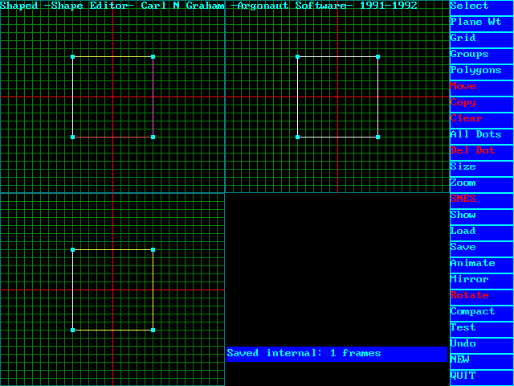

*A successful quick-save reports the number of frames but does not open a
selector. Check the loaded path before using it.*

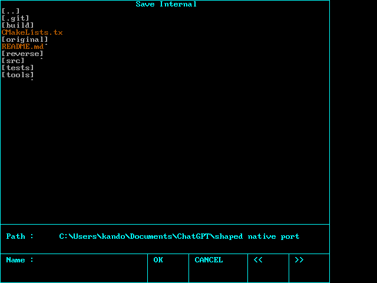

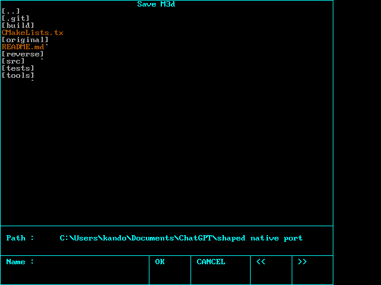

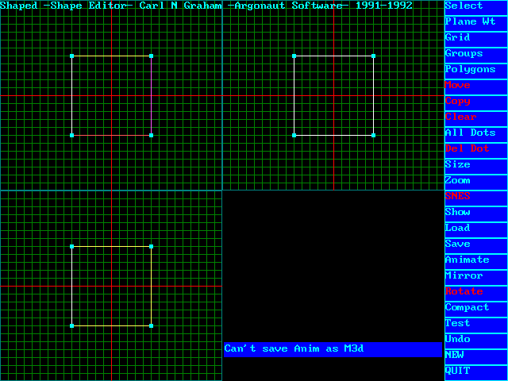

*The selector title confirms the chosen format. A multi-frame model cannot be
written as one-frame M3D/3DG1 data.*

## Assembler exporters

### ASM GZS

GZS emits point, group, visibility, normal, face, and animation macro data. It
includes recovered X/Y coordinate flipping, byte/word thresholds, mirrored-X
point compression, group-center points, and animated jump tables.

### ASM BSP

BSP emits a flat ordered face leaf for ordinary/coplanar shapes and creates BSP
partition records only when conflicting ordering constraints require a genuine
splitter. Two-point faces are retained as `Face2` line primitives in the first
face block, including line-only shapes that have no planar BSP root. The
interactive command exports without the legacy batch compaction step.

### ASM PC

PC emits the recovered word-oriented renderer command stream, including compact
coordinate components, visibility/intensity records, animated coefficient
switches, all eight polygon command forms, flat jumps, and genuine BSP nodes.

### Output naming

Assembler labels are derived from the output filename stem. For downstream
legacy assemblers, prefer a short output filename containing letters, digits,
or underscores. Directory paths may contain spaces.

The GUI exposes all three assembler formats together in the Save menu shown
earlier. For a dedicated BSP conversion workflow, use the interactive CLI
picker or the deterministic command forms in [Command-line reference](#command-line-reference).

## SNES development options

The original SNES menu controlled separate Argonaut download utilities and
development hardware; that hardware was not part of SHAPED. Native SHAPED
preserves portable inputs, address/command contracts, and assembler output but
does not claim to transfer to or emulate the original target.

### Enabling the SNES menu

Place a readable file named `sdemo.rom` in SHAPED's working directory before
launch. Its presence enables the recovered SNES condition bit and sidebar row.
The ROM's content is not executed by SHAPED.

Place `COLTABS.DAT` in the same working directory. Records use:

```text
COLTAB <name> <value>
TEXMAP <name> <value>
COLOUR <name> <value>
```

Up to 24 entries of each kind are loaded.

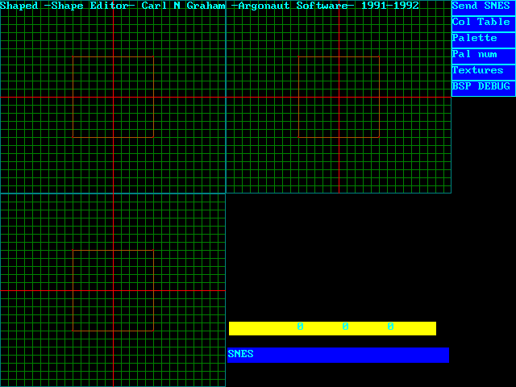

*The SNES row is enabled only when `sdemo.rom` was present at process startup.
Portable native replacements are provided for the original hardware actions.*

### SNES submenu

| Command | Native behavior and recovered contract |
|---|---|
| Send SNES | Choose a destination and write the reconstructed SNES/BSP assembler source instead of invoking `DL`. |
| Col Table | Select a `COLTAB`; substitute its name through line 2 of `GRID.DAT` into `tmpshape.asm`. A negative value enables smooth `VNORMALS` output. |
| Palette | Load exactly 512 bytes from `<name>.col` as 256 little-endian BGR555 colors. Original destination: `0x5E00`. |
| Pal num | Select 0-F, representing exact command byte `0xD0` through `0xDF`. Original destination: `0x6000`. |
| Textures | Validate/select `<name>.dat` and report its size. Original destination: `0x8000`. |
| BSP DEBUG | Toggle recovered BSP debug state. |

The loaded BGR555 palette affects only the embedded 3D-system view, never the
EGA editor or modal Preview. More evidence is in
[reverse/SNES.md](../reverse/SNES.md).

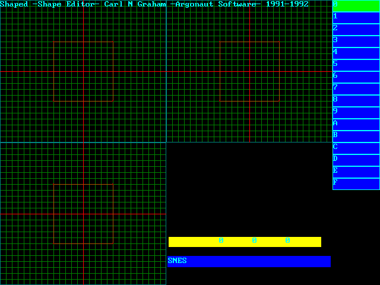

*Palette numbers are hexadecimal and map directly to renderer command bytes
`0xD0` through `0xDF`.*

## Tests and diagnostics

### BSP diagnostics

`Test > BSP` offers:

- `Nodes`: clear real polygon selection, build the current BSP, and select the
  polygons represented by its nodes/leaves.
- `Xing polys`: select mutually crossing/spanning polygon relationships.
- `Need 2 cut`: select polygons marked by the recovered two-cut diagnostic.

These commands alter polygon selection so results are visible in the editor.

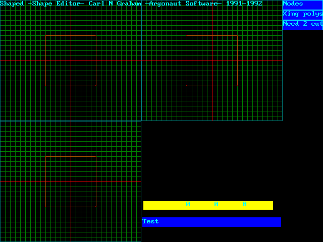

*Choose one diagnostic class; matching polygons become selected in the normal
editor views.*

### Twist

`Test > Twist` measures non-planarity for polygons with more than three
vertices. It clears selection on real polygons, selects polygons whose recovered
twist value exceeds `0.01`, and reports average twist percentage in the status
field. Triangles contribute zero twist.

For automation, `--test-twist input report` writes the average and selected
polygon indices to a text file.

### Regression suite

From a source checkout:

```powershell
ctest --test-dir build -C Release --output-on-failure
python tools\verify_layout.py reverse\native-ui-current.png
```

The registered suite covers formats, exporters, recovered callbacks, animation,
Preview edge cases, coordinate wrapping, BSP ordering, the DOS batch oracle,
and CLI BSP auto-export.

## Keyboard reference

Shortcuts respect the same enable conditions as sidebar rows. A disabled
command remains inactive.

### Normal editor

| Key | Action |
|---|---|
| `.` | Toggle Select/Add Dot mode. |
| Left / Right / Up / Down | Pan origin by five screen pixels in axes determined by the last cursor-driving pane. |
| Home | Reset editor origin X/Y/Z to zero. |
| Space | Clear dot and polygon selection. |
| Delete | Delete selected dots. |
| `M` | Move. |
| `A` | Select all active dots. |
| `Z` | Open Size Shape. |
| `L` | Load. |
| `U` | Undo/swap. |
| `X` | Confirm NEW/Delete all. |
| `Q` | Confirm quit. |
| `G` | Regroup selected polygons to current group. |
| `P` | Create polygon from selected dots. |
| `S` | Select best-matching polygon from selected dots. |
| `V` | Open Select Polygons dialog. |
| `F` | Flip selected polygon winding. |
| `O` | Rotate selected polygon vertex indices. |
| `D` | Delete selected polygons. |
| `C` | Set selected polygon color. |
| `E` | Move selected polygons to draw last. |
| `9` | Select vertices of selected polygons. |
| `W` | Internal quick-save to current path. |
| `N` | Add one animation frame. |
| `[` / `]` | Previous / next animation frame. |
| `F1`-`F8` | Set current group 1-8 and display only it. |
| `1`-`8` | Display group 1-8. |
| `F9` / `F10` | Previous / next displayed polygon. |
| Page Down | `Zoom Up`. |
| Page Up | `Zoom Dwn`. |
| `*` | Auto Zoom. |
| `#` | Enter modal Preview. |
| `=` | Save ASM PC. |
| Esc | Cancel current menu/dialog/transform and restore an active transform snapshot where applicable. |

Preview reuses several keys with different meanings; see
[Modal Preview](#modal-preview).

### Dialog editing

- Click a value cell before typing.
- The first typed character replaces the existing value.
- Backspace deletes the last character.
- Enter commits an active field; Enter again accepts dialogs that support it.
- Esc cancels the dialog or prompt.

## Command-line reference

SHAPED is a Windows GUI-subsystem executable, so automation should use process
exit codes and output-file existence rather than expecting console text.

### Help

```powershell
.\Shaped.exe --help
.\Shaped.exe -?
```

Help is displayed in a Windows dialog.

### Open a GUI model

```powershell
.\Shaped.exe "C:\Models\ship.3dcg"
```

### One-step BSP export

Open the recovered selector and save `<selected-stem>.asm` beside the input:

```powershell
.\Shaped.exe --bsp
```

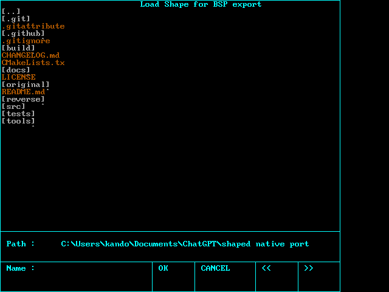

*The `--bsp` picker is intended for a one-step load-and-export workflow. It
automatically derives an `.asm` path beside the selected model.*

Convert non-interactively with automatic output naming:

```powershell
.\Shaped.exe --bsp "C:\Models\ship.3dcg"
# Writes C:\Models\ship.asm
```

Choose the output explicitly:

```powershell
.\Shaped.exe --bsp "C:\Models\ship.3dcg" "C:\Output\ship.asm"
```

`--export-bsp` accepts the same input and optional output forms.

### Legacy BSP batch form

```powershell
.\Shaped.exe -b input.3dcg output.asm
.\Shaped.exe -b input.3dcg
```

When output is omitted, `.asm` replaces the input extension. Unlike the modern
`--bsp` path, `-b` runs the recovered Compact operation before BSP conversion.

### Other deterministic exporters

```powershell
.\Shaped.exe --export-gzs input.3dcg output.asm
.\Shaped.exe --export-pc input.3dcg output.asm
.\Shaped.exe --export-internal input.3dg output.3dcg
.\Shaped.exe --export-3dg1 input.3dcg output.3dg
.\Shaped.exe --test-twist input.3dcg report.txt
```

These forms require explicit output paths.

### Exit codes

| Code | Meaning |
|---:|---|
| `0` | Requested conversion/export succeeded. |
| `1` | Input could not be loaded, output could not be written, or conversion failed. |
| `2` | Interactive `--bsp` selector was cancelled. |

### PowerShell example

```powershell
& .\Shaped.exe --bsp "C:\Models\ship.3dcg"
if ($LASTEXITCODE -ne 0) {
    throw "SHAPED BSP export failed with exit code $LASTEXITCODE"
}
```

## Limits and recovered behavior

| Limit or behavior | Value/details |
|---|---|
| Dot slots | 500 |
| Polygon slots | 500 |
| Vertices per polygon | 16 |
| Animation frames | 128 |
| Key-animation control dots | 16 |
| Polygon groups | 8 |
| Polygon color | 0-255 |
| Coordinates | Signed 16-bit DOS wrapping after truncation |
| Undo | One swap snapshot; pressing Undo again swaps back like a one-level redo |
| Editor render colors | Fixed EGA selection colors, independent of stored polygon color |
| Compaction merge radius | `max(Grid / 8, 1)` |

### Operations and Undo

SHAPED has one global snapshot, not a history stack. Many modifying commands
replace that snapshot. Undo swaps current and saved states, so pressing Undo
again swaps back. Some recovered callbacks, such as polygon `Rot vert`, do not
create their own snapshot.

### Current-frame versus all-frame behavior

- Move and normal Rotate edit the current animation frame.
- Copy preserves and moves copied coordinates across all frames.
- Mirror operates across all frames.
- Size can target current frame or all frames.
- Deleting a selected dot deactivates it across all frames.
- Polygon topology and metadata are shared across frames.

### Selection flags across frames

The global ordered dot selection is reapplied to the destination frame whenever
you navigate frames. Several recovered operations intentionally spread the
current frame's active flags to all frames before transforming/exporting.

## Troubleshooting

### A command is red and cannot be clicked

Red means its recovered enable condition is not met. Common requirements are:

- At least one active dot.
- At least one selected dot.
- At least one active polygon.
- At least one selected polygon.
- More than one animation frame.
- SNES mode enabled by `sdemo.rom`.

### `Shape Not Compacted`

Run `Compact`, review its status summary, then save again. Remember that the
current grid controls merge tolerance.

### `Can't save Anim as M3d`

`3DG1` is a one-frame format. Save `3DCG`, or reduce the shape to one frame.

### `Alien file format`

The selected file opened but did not begin with a supported `3DG1`, `3DCG`,
`3DAN`, or `3DA1` grammar. File extension alone does not determine format.

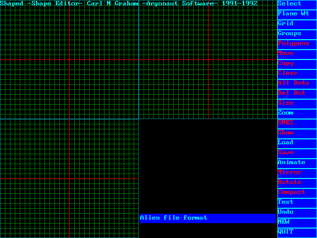

### `File <...>?` or `File Error`

The path could not be opened/read/written, or an auxiliary SNES data file was
missing or had the wrong length. Verify permissions, spelling, working
directory, and the data-file contracts in the SNES section.

### Dot or polygon buffer full

The shape has reached 500 dot or polygon slots, or an add-image transform would
exceed them. Delete unwanted content and Compact before retrying.

### A click does not select a crowded dot

The recovered picker rejects ambiguous candidates. Zoom in, hide unrelated
groups, adjust the origin, or use another projection.

### The saved assembler has an awkward label

Assembler labels come from the output filename stem. Save to a short stem made
from letters, digits, and underscores, such as `ship_body.asm`.

### SNES is unavailable

Launch SHAPED with `sdemo.rom` present in the process working directory. For
dynamic menus, also provide a valid `COLTABS.DAT` and the named `.col`, `.dat`,
or `GRID.DAT` files. Native SHAPED does not require or invoke the original `DL`
hardware downloader.

### SmartScreen warns about the EXE

Version 1.0.1 is not Authenticode-signed. Download it from the official GitHub
release and compare its SHA-256 digest with `SHA256SUMS.txt` before running.
